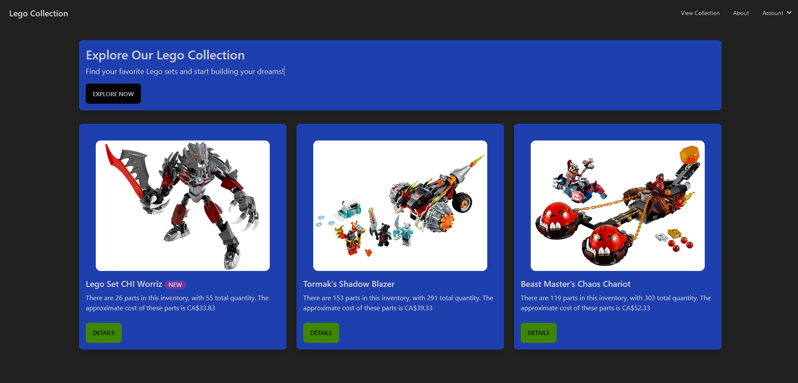
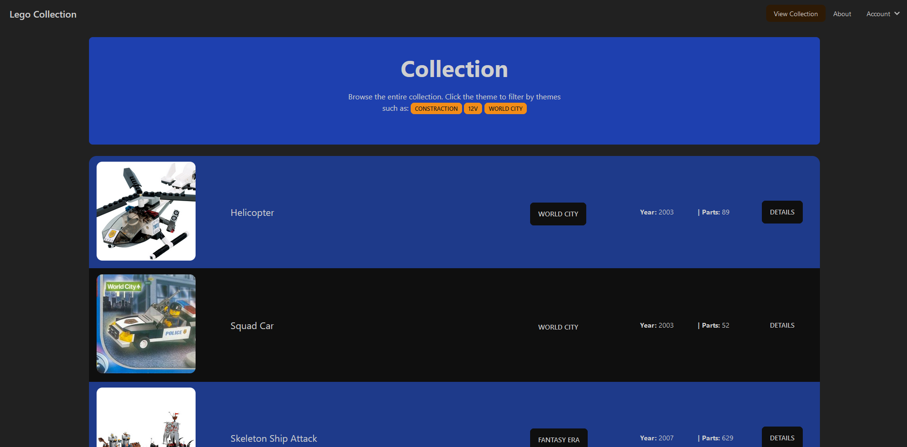

# Lego Collection Website

Welcome to the Lego Collection Website repository! This project is designed to help you practice your web development skills, focusing on both frontend and backend technologies. The website allows users to manage their Lego collections, utilizing ES6, Tailwind CSS with daisyUI, ExpressJS, MongoDB, PostgreSQL, JSON, AJAX, and EJS.

## Project Overview

The Lego Collection Website provides a platform for Lego enthusiasts to catalog and manage their Lego sets. Users can add, edit, and remove sets from their collection, as well as view details and images of each set. The website is built using modern web development technologies and aims to provide a seamless user experience.

## Visit Webpage

Click [Lego Collection Website](https://sudoku-website.netlify.app) to visit the Lego Collection Website.

### Screenshots

